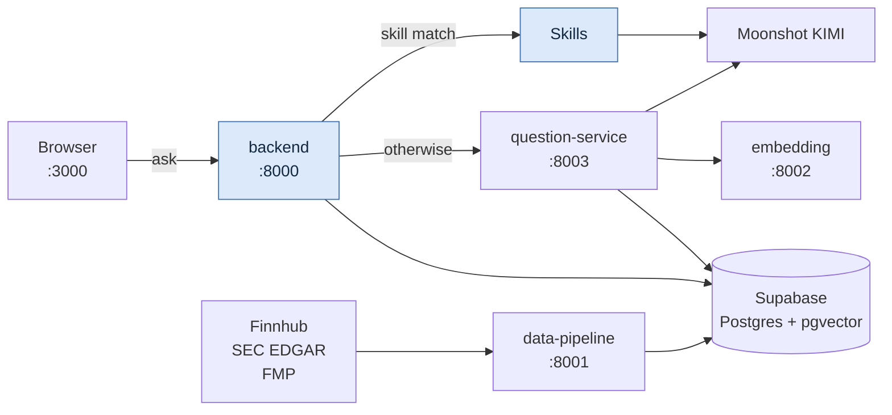
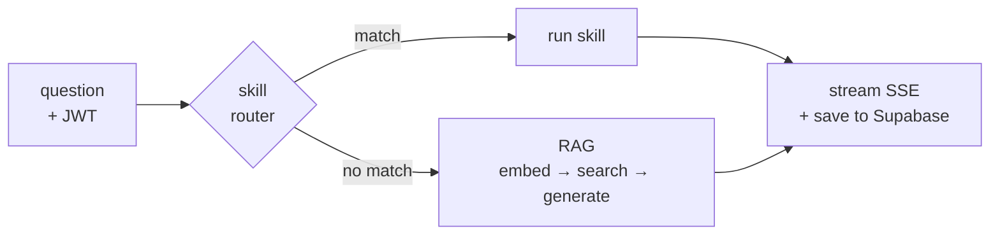

# QuantAgent

Financial research assistant: daily briefings, watchlist management, RAG-based
Q&A over SEC filings and news, and on-demand ticker research reports.

**This is the entry point for the whole system.** Clone this repo and nothing
else — `./dev.sh` pulls the other four repos, installs everything, and tells
you exactly what is still missing.

```bash
mkdir ~/quantagent && cd ~/quantagent
git clone https://github.com/ZeroNoise2026/QuantAgent.git
cd QuantAgent && ./dev.sh
```

That one command syncs the sibling repos, creates a venv per service, scaffolds
every `.env`, and prints a readiness report. Then fill in your credentials and
`./dev.sh up`.

## Architecture



Blue is this repo. The backend authenticates, keeps the conversation, and picks
**skill or RAG** — nothing else lives here.

**One chat request:**



**One ingestion run:** `data-pipeline` pulls news, filings and quotes → cleans →
chunks → embeds via `:8002` → upserts into Supabase. Nothing else writes those
tables.

| Tables | Owner |
|---|---|
| `documents` `earnings` `price_snapshot` `tracked_tickers` | data-pipeline |
| `chat_sessions` `chat_messages` `user_files` `user_watchlist` `user_preferences` `daily_briefings` | backend |
| `summary_cache` | Summarization |

Schema for the shared tables lives in `../data-pipeline/pipeline/schema.sql`;
`backend/migrations/` owns the user-scoped ones and their RLS policies.

## The system

Five repos, deliberately separate — each deploys on its own cadence.

| Repo | Role | Port |
|---|---|---|
| **QuantAgent** (this one) | React UI + FastAPI BFF. Auth, watchlist, briefings, chat. | 3000 / 8000 |
| [Summarization](https://github.com/ZeroNoise2026/Summarization) | `summary` CLI (research reports) + `question` service (RAG Q&A) | 8003 |
| [data-pipeline](https://github.com/ZeroNoise2026/data-pipeline) | Ingest Finnhub / SEC EDGAR / FMP → clean → chunk → embed → Supabase | 8001 |
| [embedding-service](https://github.com/ZeroNoise2026/embedding-service) | all-MiniLM-L6-v2, 384-dim vectors | 8002 |
| [Skills](https://github.com/ZeroNoise2026/Skills) | Shared skill framework (`generate_report`, `compare_tickers`) | — |

`./dev.sh sync` clones them **as siblings of this repo**, not inside it:

```
~/quantagent/
├── QuantAgent/          <- you cloned this
├── Skills/              <- pulled by ./dev.sh sync
├── Summarization/
├── data-pipeline/
└── embedding-service/
```

Sibling, not nested, is load-bearing: every cross-repo import resolves through
`Path(__file__).parents[N]` assuming exactly this shape. Nesting silently
breaks skill discovery.

## Layout

```
QuantAgent/
├── dev.sh                    stack bootstrap + launcher
├── backend/                  FastAPI BFF
│   ├── main.py               API server; routes skills before falling back to RAG
│   ├── rag.py                proxies the question-service SSE stream
│   ├── briefing.py           scheduled daily briefing generator
│   ├── summarizer.py         Moonshot client for summaries + briefings
│   ├── fetcher.py            TickerContext assembly from Supabase
│   ├── db.py                 Supabase data access
│   ├── auth.py               Supabase JWT verification
│   ├── files/                upload, parse and preview (pdf/docx/xlsx/csv/txt)
│   ├── migrations/           SQL migrations
│   └── evals/                offline eval suite — see backend/evals/README.md
└── frontend/                 React + Vite
    └── src/pages/            Chat, Briefing, Watchlist, Login, Signup
```

## API

| Method | Path | Description |
|---|---|---|
| GET | `/api/tickers` | Tickers available for the watchlist |
| GET/POST | `/api/watchlist` | Read / add |
| DELETE | `/api/watchlist/{ticker}` | Remove |
| GET/PUT | `/api/preferences` | Timezone, briefing toggle |
| GET | `/api/briefings` · `/latest` · `/by-date` · `/dates` | Briefing history |
| POST | `/api/briefings/refresh` | Generate one now for the watchlist |
| POST | `/api/chat/stream` | SSE chat — skill routing, then RAG |
| GET/DELETE | `/api/chat/sessions` | Session list / bulk delete |
| GET | `/api/chat/sessions/{id}/messages` | Session transcript |
| POST | `/api/summarize` | On-demand ticker report |
| — | `/api/files/...` | Upload, list, preview, download, attach, delete |
| GET | `/health` | Liveness |

The frontend dev server proxies `/api` to `http://localhost:8000`, so no CORS
configuration is needed locally. In production set `ALLOWED_ORIGINS`.

## Authentication

Supabase Auth (email + password). Every backend route requires
`Authorization: Bearer <jwt>`.

One-time Supabase setup:

1. **Authentication → Providers → Email**: enable.
2. **Authentication → Settings → Confirm email**: off for dev, otherwise users
   cannot log in until they click the confirmation mail.
3. **Project Settings → API → JWT Settings**: copy the JWT Secret into
   `backend/.env` as `SUPABASE_JWT_SECRET`.
4. Run `backend/migrations/002_auth_uuid_rls.sql` in the SQL editor.
   ⚠️ It **TRUNCATEs** `chat_sessions`, `chat_messages`, `user_watchlist`,
   `user_preferences`, `daily_briefings` — the old localStorage user ids cannot
   be mapped onto real `auth.users.id` rows.

Database schema lives in `../data-pipeline/pipeline/schema.sql` (single source
of truth for every table in the project).

## Credentials

`./dev.sh setup` writes an `.env` per service with the keys listed and the
values blank. You need:

| Where | Keys |
|---|---|
| `backend/.env` | `SUPABASE_URL` `SUPABASE_KEY` `SUPABASE_JWT_SECRET` `MOONSHOT_API_KEY` |
| `frontend/.env.local` | `VITE_SUPABASE_URL` `VITE_SUPABASE_PUBLISHABLE_KEY` |
| `../Summarization/.env` | `SUPABASE_URL` `SUPABASE_KEY` `MOONSHOT_API_KEY` |
| `../data-pipeline/.env` | `SUPABASE_URL` `SUPABASE_KEY` `FINNHUB_API_KEY` `FMP_API_KEY` `EDGAR_USER_AGENT` |
| `../embedding-service/.env` | none required |

Supabase values: Dashboard → Project Settings → API (the JWT secret is under
API → JWT Settings). `SUPABASE_KEY` is the **service-role** key — server-side
only, it bypasses RLS.

`./dev.sh doctor` treats placeholder values (`sk-xxxxxxxx`,
`your-supabase-service-role-key`) as missing, so copying `.env.example` by hand
will not fool it.

## Evals

`backend/evals/` is an offline eval suite for `summarizer.py`: deterministic
structural checks first, then a claim-level LLM judge for faithfulness.

```bash
./dev.sh eval                 # n=3 per fixture, thresholds enforced, exit 1 on failure
./dev.sh eval --no-judge      # structural checks only — free and instant
```

It needs only `MOONSHOT_API_KEY` — no Supabase, no running services. See
[`backend/evals/README.md`](backend/evals/README.md) for what is measured, the
thresholds, and the design notes.

## Deployment

`backend/Dockerfile` is Cloud Run ready and honours `$PORT`. Note that the
build context is `backend/`, so it cannot reach the sibling `Skills` repo —
`requirements.txt` therefore installs the skills package straight from git.
Without that line, skill routing silently degrades to RAG on every request.

## dev.sh

```bash
./dev.sh                 # sync + setup + doctor  (idempotent, start here)
./dev.sh sync            # clone/pull the sibling repos
./dev.sh setup [svc...]  # venvs, deps, .env scaffolding
./dev.sh doctor          # what is ready, what is blocked, and why
./dev.sh test            # offline suites — zero credentials needed
./dev.sh eval            # summarizer eval suite (needs MOONSHOT_API_KEY)
./dev.sh up [svc...]     # start services; refuses any with missing credentials
./dev.sh down / status / logs <svc>
```

Services: `embedding` `pipeline` `question` `backend` `frontend`.
Use `GIT_PROTOCOL=ssh ./dev.sh sync` if you prefer SSH remotes.

Notes on behaviour that surprises people:

- **One venv per service, not one shared.** Summarization pins
  `fastapi==0.104.1` / `pydantic==2.5.0`; this backend is unpinned. A shared
  venv silently breaks one of them.
- **`up` refuses to start a service whose credentials are missing**, instead of
  starting it and dying inside a stack trace.
- **`.env` scaffolding keeps real defaults and empties only placeholders.**
  Blanking everything would break `embedding-service`, whose config does
  `int(os.getenv("EMBEDDING_DIM", "384"))` — a present-but-empty var is not the
  default, it is `int("")`. Existing `.env` files are never overwritten.
- `dev.sh` installs `Skills` **editable from the local clone**, overriding the
  git pin in `requirements.txt`, so edits there take effect without a push.

## Running without dev.sh

```bash
cd backend
python3 -m venv venv && source venv/bin/activate
pip install -r requirements.txt
uvicorn main:app --port 8000 --reload

cd ../frontend
npm install && npm run dev          # http://localhost:3000
```

The briefing job runs hourly via GitHub Actions and generates a briefing when a
user's local time is 08:00–08:14; test it with `python backend/briefing.py`.
